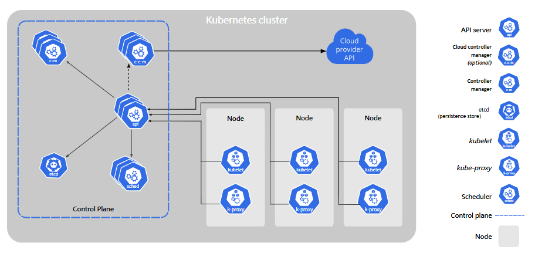

# K8S Compoenents 
Componenets required in K8S to run container?
**Kubelet**

**Kubectl**
- K8S command-line tool
- works on deploy apps, inspect and manage cluster resources, and logs.

More about kubectl [https://kubernetes.io/docs/reference/kubectl/]

# K8S Concept
## Cluster Architecture


K8S has a control plane + a set of worker machines(ndoes)
= used to run containerized applications
*Each cluster needs at least one worker node*[ = runing pods]

**[ Worker Nodes ]**
Worker nodes才是那個運行applications 的machines，而他們run的是pods，也就是 pods是smallest unit 去hold住containerized的app的個體。

**[ Control Plane ]**
K8S system's brain.
負責看守全部的worker nodes然後monitor所有東西。
例如
- 決定app要在哪裏run
- 檢查裏面的health status

一般來説， production env一般都會run **Control Plane** on more than one machine， 然後cluster都會有多過一個的worker node（以確保HIGH AVAILABILITY （HA））

**[ kube-proxy ]**
在worker node裏面run的小program. 
主要工作： help route traffic

*尤其是pod要跟另一個pod/service進行通訊的時候*


# References
Reference 1: Official Website
```
https://kubernetes.io/zh-cn/docs/setup/
```

**Notably** 
 Recommend to ```run the components of K8s in container``` images within the cluster.```
(So that the K8s can manage those components)


!! To avoid managing the Kubernetes Cluster by yourself, choose cloud service provider.